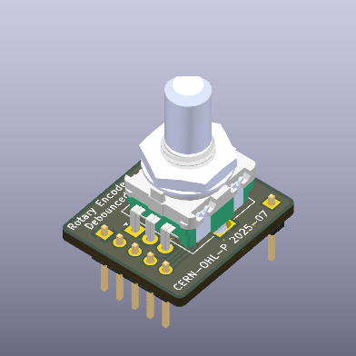

# Rotary Encoder Debounced

A rotary encoder tracks shaft rotation by outputting pulses. However, mechanical switches in encoders suffer from contact bounce, causing false signals.

This projet propose a solution to debounced Rotary Encoder signal at hardware level.

  

## The Problem

When encoder contacts close or open, they bounce, creating multiple rapid signal changes. These can be misinterpreted as several rotations or direction changes.

  
*Signal captured on a rotary encoder without debouncer*

*Resulting signal of a noisy input*

## The solutions

### Software Debouncing is not statisfying

Software debouncing filters out noise but has drawbacks:

* Timing needs are precise and hard to maintain at varying speeds.

* Processing overhead increases, burdening limited systems.

* Complexity rises with advanced algorithms.

### Hardware Debouncing is more reliable

This project uses hardware to debounce signals reliably by associating low-pass filters with schmitt triggers.

#### Low-Pass Filter

A simple RC circuit smooths the signal by filtering high-frequency noise, averaging rapid changes.

Filter has been designed to have a cutoff frequency of 1,59kHz with a time constant of 100µs.

#### Schmitt Trigger

Schmitt trigger, with two voltage thresholds, converts the filtered signal to a clean digital output. Hysteresis prevents noise from causing false transitions.

This combination removes bounce issues and provide a clean signal where noise is removed.

Hardware has been designed to use the smallest possible PCB. Pin header have been placed to ensure connectivity as well as mounting solution. Pin header placement have been placed to be compatible with breadboards.

## Realisation
Schematic, PCB, 3D views are designed with KiCad 9 with the following plugins:

* Interactive Html Bom [🔗](https://github.com/openscopeproject/InteractiveHtmlBom)  
  See the bill of material [here](https://xavierberger.github.io/RotaryEncoderDebounced/ibom.html)
* KiCAD JLCPCB tools [🔗](https://github.com/bouni/kicad-jlcpcb-tools)  
  This plugin allows you to search the JLCPCB parts database, assign LCSC article numbers to your parts, generate production files for JLCPCB and much more.
* Fabrication Toolkit [🔗](https://github.com/bennymeg/Fabrication-Toolkit)  
  Toolkit for automating PCB fabrication process with KiCad and JLCPCB. 

*Note: I used* **Fabrication Toolkit** *to generate production file since I noticed that component orientation of component is correct while it wans't in* **KiCAD JLCPCB tools**.

Components have been choosen to be "**Basic**" parts of JLCPCB to reduce the manufactirung cost.

The cost of the PCB fabrication and SMD assembly (so without the rotary encoder and pin headers) is about 7€ for 5 pieces.

## Analysis of results

On the oscilloscope, we can see a clean signal. The noise has been filtered-out.

  
*Signal captured on a rotary encoder with hardware debouncer*

The resulting signal captured with a logical analyser is also clean.

*The resulting signal is clean*

Even when the capture rate is pushed up to the limit of the logical analyser, the signal remain clean.

Software debouncer is then no more needed and it is possible to base the algorithm on edge detection.

## License

Licensed under [CERN-OHL-P](LICENCE.txt). Free to use and modify.
